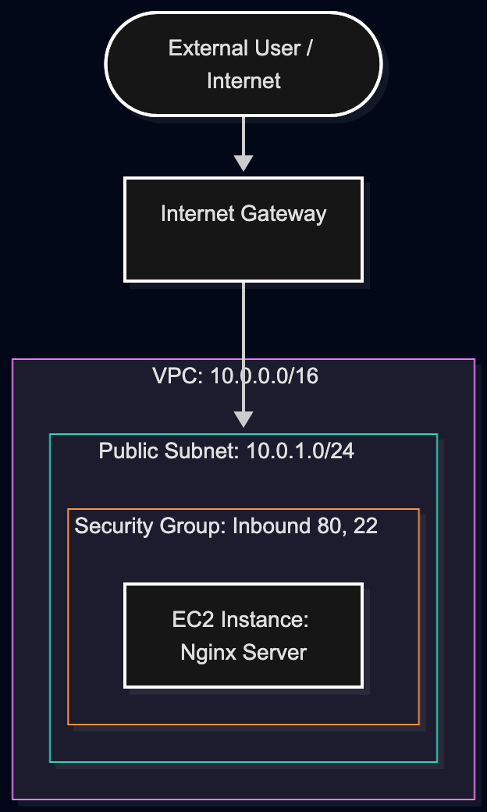
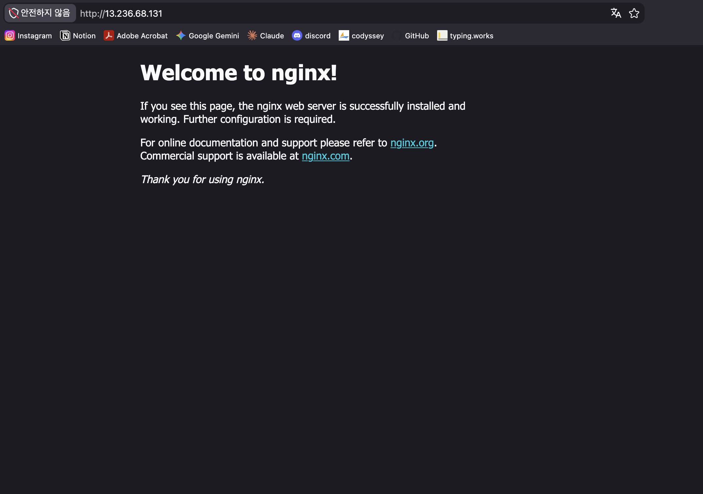

# AWS 클라우드 기반 웹 서비스 배포 및 인프라 구축

본 프로젝트는 AWS 클라우드 환경에서 VPC(Virtual Private Cloud) 기반의 격리된 네트워크를 설계하고, EC2 인스턴스에 Nginx 웹 서버를 배포하여 외부 접속을 검증한 실습 과제 결과물입니다. 최소 권한 원칙(IAM)과 보안 그룹(Security Group) 설정을 적용하여 보안을 강화하였습니다.

---

## 1. 아키텍처 다이어그램

인프라는 VPC 내 Public Subnet에 EC2 인스턴스를 배치하고, Internet Gateway를 통해 외부 트래픽을 수신하도록 구성되었습니다.



---

## 2. 인프라 구성 명세

| 구분 | 구성 요소를 명시 | 세부 설정 값 |
| :--- | :--- | :--- |
| **Region** | 서울 리전 | `ap-northeast-2` |
| **VPC** | VPC 1개 | CIDR: `10.0.0.0/16` |
| **Subnet** | Public Subnet 1개 | CIDR: `10.0.1.0/24` |
| **Internet Gateway** | IGW 1개 | VPC에 Detach/Attach 설정 |
| **Route Table** | Public Route Table | `0.0.0.0/0` -> Internet Gateway |
| **Security Group** | Inbound Rules | - **HTTP (80)**: `0.0.0.0/0` (전체 허용)<br>- **SSH (22)**: `내 IP` (소정의 IP 대역 제한) |
| **EC2 Instance** | 가상 서버 1대 | OS: Ubuntu Server 24.04 LTS (x86)<br>Instance Type: `t2.micro` / `t3.micro` |
| **Storage** | EBS Volume | 8 GiB (gp3) |


### IAM 최소 권한 원칙 적용 (Least Privilege)
* **전용 IAM 사용자 생성**: Root 계정 대신 EC2 및 VPC 제어 전용 IAM 사용자(`cloud-user`)를 생성하여 실습을 진행했습니다.
* **최소 권한 정책 적용**: `AdministratorAccess` 대신 EC2/VPC 제어 및 CloudWatch 로그 확인 권한만 포함된 커스텀 정책(`EC2-VPC-Limited-Policy`)을 할당했습니다. S3, RDS, IAM 계정 관리 등 과제 범위 외 권한을 차단하여 보안 유출 및 무단 과금 리스크를 최소화했습니다.


### 리소스 태그 및 네이밍 컨벤션 (Naming & Tagging)
* **네이밍 규칙**: 리소스의 용도와 프로젝트 식별을 위해 `mission-[리소스종류]` 형태의 일관된 식별자를 부여했습니다.
  - VPC: `mission-vpc`
  - Subnet: `mission-public-subnet`
  - Internet Gateway: `mission-igw`
  - Security Group: `mission-web-sg`
  - EC2 Instance: `mission-web-server`
* **태그 규칙**: 모든 리소스에 `Project: Cloud-Mission`, `Environment: Dev` 태그를 공통 부여하여 리소스 관리 및 추적성을 확보했습니다.

---

## 3. 외부 접속 검증

과제 요구사항에 맞춰 외부 접속 가능 여부를 검증하고 명시하였습니다.

* **선택한 검증 방식**: **(A) 브라우저로 `http://13.236.68.131`(퍼블릭IP) 접속**
* **접속 IP / URL**: `http://13.236.68.131` *(실제 배포했던 퍼블릭 IP 기재)*
* **응답 결과**: Nginx 기본 환영 페이지 (`200 OK` / `Welcome to nginx!`) 정상 출력

### 접속 결과 증빙 스크린샷


---

## 4. 트러블슈팅 요약

실습 과정 중 발생했던 네트워크/권한 관련 문제와 해결 과정은 [`docs/troubleshooting.md`](./docs/troubleshooting.md) 문서에 상세히 기록되어 있습니다.

* **대표 문제 사례**: 유동 IP 변경에 따른 SSH 접속 타임아웃 오류 (`Operation timed out`)
* **주요 원인**: 학습자 로컬 환경의 공인 IP가 변경되어 보안 그룹 인바운드 규칙과 불일치
* **조치 내용**: AWS 콘솔 보안 그룹에서 SSH(22) 포트의 소스 IP를 현재 공인 IP로 재설정하여 해결

---

## 5. 리소스 정리 체크리스트

과금 방지를 위하여 모든 실습 리소스는 정상적으로 종료 및 삭제 조치하였으며, 상세 내역 및 증빙은 [`docs/cleanup-checklist.md`](./docs/cleanup-checklist.md)에서 확인하실 수 있습니다.

- [x] EC2 인스턴스 종료 (`Terminated`)
- [x] EBS 볼륨 삭제
- [x] Elastic IP 해제 (`Release`)
- [x] Internet Gateway 삭제
- [x] VPC 및 Subnet 삭제
- [x] AWS Billing Dashboard 0원 유지 확인

---
## 6. 네트워크 설계 및 Outbound 트래픽 필요성, IAM과 SG의 차이

### Public Route 및 Outbound 트래픽의 필요성
* **Outbound 인터넷 통신 필수**: EC2 인스턴스가 패키지 저장소에 접근하여 OS 보안 패치(`sudo apt update`) 및 웹 서버 프로그램 설치(`sudo apt install nginx`)를 수행하려면 외부 인터넷으로 나가는 **Outbound 트래픽**이 반드시 허용되어야 합니다.
* **Public Route 역할**: Public Subnet 라우팅 테이블에 `0.0.0.0/0 -> Internet Gateway` 경로를 설정함으로써, 인스턴스의 패키지 다운로드(Outbound)와 외부 사용자의 웹 접속 요청에 대한 응답 트래픽 송신이 가능하도록 구성했습니다.

### Security Group vs IAM 핵심 차이 요약
> **Security Group**은 네트워크 레이어에서 IP 및 포트 번호 기반으로 EC2 인스턴스에 들고나는 **트래픽을 제어하는 가상 방화벽**이며, **IAM**은 사용자 및 서비스 단위로 AWS API 호출 및 **리소스 관리 권한을 제어하는 인증·인가 체계**입니다.

---
## 7. 프로젝트 디렉터리 구조

```text
.
├── README.md
└── docs/
    ├── architecture.png        # 아키텍처 다이어그램 이미지
    ├── external_access.png     # 외부 접속 성공 증빙 스크린샷
    ├── ec2_terminated.png      # EC2 종료 상태 증빙 스크린샷
    ├── billing_proof.png       # 과금 방지 대시보드 스크린샷
    ├── troubleshooting.md      # 트러블슈팅 보고서
    └── cleanup-checklist.md    # 리소스 정리 체크리스트
