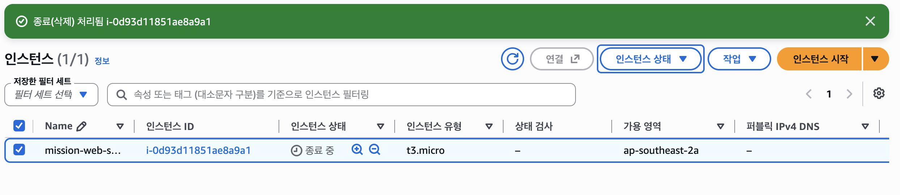
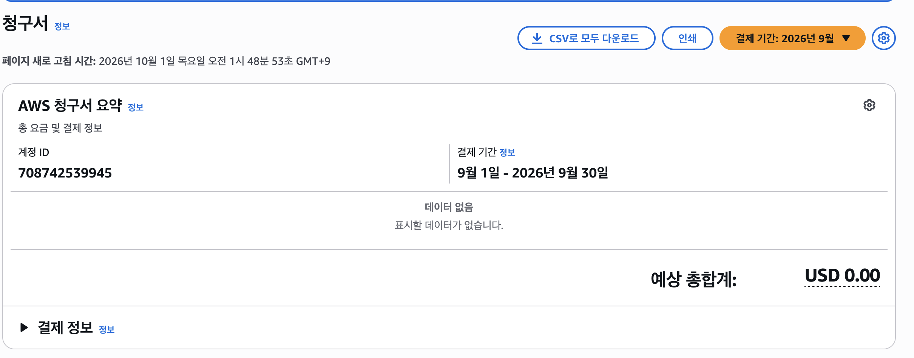

# 리소스 정리 체크리스트

과금 방지를 위해 모든 실습 리소스의 삭제/종료 상태를 확인하였습니다.

- [x] **EC2 인스턴스**: Terminated (종료) 상태 확인
- [x] **EBS 볼륨**: 미사용 볼륨 삭제 확인
- [x] **Elastic IP**: 할당 해제(Release) 완료
- [x] **Internet Gateway**: VPC Detach 및 삭제 완료
- [x] **VPC 및 Subnet / Route Table**: 삭제 완료[cite: 1]
- [x] **Billing Dashboard**: 과금 항목 0원 유지 확인[cite: 1]

## 삭제 증빙 스크린샷

## 무과금 증빙 스크린샷

